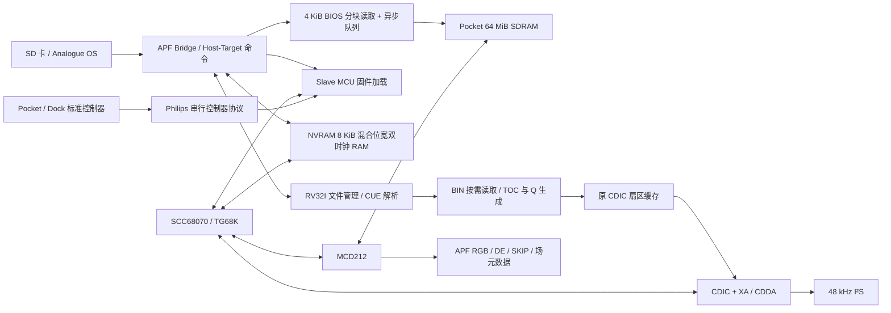

# 平台适配

视频输出独立于机器复位：加载期间发送 768×280 PAL 完整黑帧，不依赖显示缓存保存什么内容。MCD212 在启用独立光标，或启用有编码方式的图像平面时锁存显示初始化；依据实际渲染条件，不检查原实现未使用的 DCR1.DE 位。适配器检查连续两个完整帧的几何与隔行模式，再结束当前黑帧并在原生 VS 边界切入画面。正常运行中的暂停保留原生帧；复位重新检查。此流程只增加计数器与时序编码器，没有增加帧缓存。

| Pocket Bridge 地址 | 用途 |
| --- | --- |
| `0x10000000–0x1007FFFF` | 系统 BIOS 写入队列，写到 SDRAM `0x00400000` |
| `0x20000000–0x20001FFF` | Slave 固件写入队列，每个 Bridge 字按大端字节顺序拆分 |
| `0x40000000–0x40001FFF` | NVRAM 原生 32 位读写窗口 |
| `0x50000000` | PAL / NTSC 设置 |
| `0x50000004` | 启动 / 内存 / 队列状态位 |
| `0x50000008` | `[8:6]` BIOS 错误、`[5:3]` 保存错误、`[2:0]` 光盘错误 |
| `0x5000000C` | CUE 文件大小 |
| `0x50000010` | 文件管理程序的启动阶段 / 解析错误 |
| `0x60000000–0x6001FFFF` | 文件管理助手的 128 KiB 程序 / 数据 RAM |
| `0x6001E000–0x6001EA07` | RAM 内的一次 2568 字节扇区暂存区 |
| `0xF8000000` | APF Host / Target 命令和数据槽表 |

数据槽 ID 0 为 CUE，1 为 BIOS，2 为 Slave，3 为 NVRAM，4 为动态 BIN 读取槽。CUE、BIOS 与 BIN 使用 deferload；BIN 槽为可选槽，无需用户逐个选择。SDRAM 物理初始化约 0.5 ms 后即可进入框架 Setup 阶段；基础机器的 1 MiB RAM 清零、后台刷新与资源加载继续进行，清零可被加载队列暂停。

框架 Ready 与机器 Ready 分开。`pocket_startup` 在资源许可/传输完成、内存可接收且加载未溢出后锁存框架 Ready，向 APF 发出 `0140 Ready to Run`。Target 文件操作在框架的 `0011 Reset Exit` 后才开始，避免启动检查遇到尚未处理的 BIOS 读取请求。`pocket_file_io` 每读取 4 KiB BIOS 后等待异步队列完全写入 SDRAM，再发出下一次请求。CD-i CPU 仍等实际 BIOS、Slave、RAM、光盘解析和加载完成后才解除复位。APF 的 Running 状态表示框架后台已运行，不表示 CD-i CPU 已解除复位。

数据槽许可由 `pocket_slot_policy` 统一处理。OS 2.7 启动时会在延迟加载 CUE 的数据传输被跳过之前先发出 `0082`；槽 0 / 4 因此也应按 JSON 的长度上限接受元数据许可。BIOS / Slave / NVRAM 继续检查固定长度；NVRAM 的确认必须等待 CPU 访问暂停。延迟加载属性保留，CUE / BIN 由助手按需读取。

Bridge 读取经过统一的返回缓冲。APF SPI 先返回上一次读请求的结果，再发出当前请求；返回数据必须在切换地址和区域时保持，不得由新地址提前替换。命令寄存器、原生助手 RAM、NVRAM 与诊断寄存器使用同一返回节拍。

助手启动时通过 APF `0190` 获取所选 CUE 的完整路径，`0180` 读取最多 32 KiB 文本，再解析轨道与相对 BIN 路径。通过 `0192` 将引用的 BIN 打开到槽 4，从 APF 的 ID / 大小表查找文件长度并核对 2352 字节扇区几何。槽 4 可反复打开不同文件，因此 99 个 BIN 不需要 99 个数据槽。操作标志始终为零，数据槽为只读，不创建或修改镜像。助手使用 74.25 MHz Bridge 时钟，程序内嵌在位流的 RAM 初始化数据中，不需要安装另一份用户固件。

APF 在解除机器复位前就选择光盘，因此伺服控制器在复位时按挂载状态初始化盘型，避免提前发生的挂载事件被复位吞掉。

系统 PLL 提供约 30 MHz 及相移 90° 视频时钟。独立音频 PLL 提供 12.288 MHz。CDIC 的 75 Hz、37.8 kHz、44.1 kHz 使能通过 30 MHz 分数计数器生成。二进制数据跨时钟采用有握手的稳定缓冲区或厂商异步 FIFO；NVRAM 使用 8 位 CPU / 32 位 Bridge 的混合位宽存储块。

菜单通知 `00B0` 经同步后由 `pocket_pause` 控制 Cyclone V 专用时钟使能。使能在下降沿采样，符合器件的[时钟使能说明](https://docs.altera.com/r/docs/683375/current/cyclone-v-device-handbook-volume-1-device-interfaces-and-integration/clock-enable-signals)。仅在垂直消隐、读写请求撤销、SDRAM busy 与 burst-valid 连续两拍消失后停止机器时钟，使最后一个突发数据和 busy 下降沿确认先被消费。SCC68070、MCD212、CDIC、Slave、控制器、扇区缓存和扇区输出端共用此时钟，状态保持。

APF Bridge、RV32I 文件助手、加载队列、SDRAM 控制器及视频/音频输出时钟继续运行。暂停时内存仲裁器接管后台刷新；恢复先等待刷新完成，避免把刷新 busy 下降沿当作机器访问确认。视频适配器在消隐中保持无活动像素，I²S 在完整帧边界输出零采样，关闭菜单后恢复音频。挂载事件和 NVRAM 变更事件的源端使用机器时钟，避免暂停时将保持的单拍信号重复发送。核心复位强制打开机器时钟，确保菜单内的重置不会阻塞。

原 SDRAM 控制器的物理地址改为 Pocket 的 13 行位、10 列位几何，字节掩码独立驱动 DQM，不再借用 MiSTer 的地址高位。读取使用引脚附近的无条件输入采样寄存器；MCD212 仍按 busy / burst-valid 时刻消费数据。

CDIC 的负 LBA `0xFFFF0000` 请求 TOC。助手按低 7 位序号循环生成 A0 / A1 / A2 与轨道起点。正常绝对 MSF 请求按 CUE 的轨道、INDEX 与 PREGAP 映射到 BIN 的 `源扇区 * 2352` 偏移。数据扇区必要时去扰码，CDDA 原始采样字节保持不变；合成间隙及 lead-out 的原始数据为零。

每个内部记录为 2568 字节：2352 字节原始数据、12 个扩展成大端 16 位的 Q 字节及 96 个置零的 R-W 字，共 1284 个 16 位字。这是内部接口，不是 SD 卡文件格式。缓冲区在 APF 写入、助手补全与 30 MHz 缓存传输之间交接所有权，流出完成前不能覆盖。请求带有代数标记，复位后的旧请求不能发布；读取或布局错误不向 CDIC 发布部分扇区。

平台不实例化 VMPEG 或 DDR3。DVC 地址窗口返回总线错误；视频直接来自 MCD212，音频保留原 Slave 控制的衰减器。原模块中的 DVC 配置和调试通道已被移除或常量化，不参与硬件综合。
